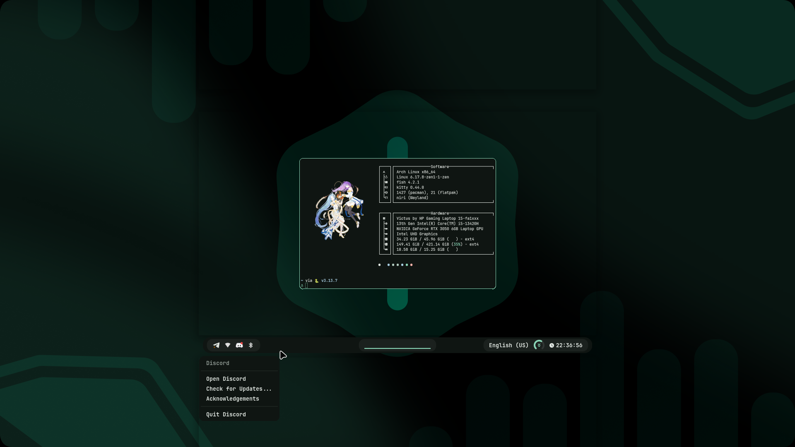
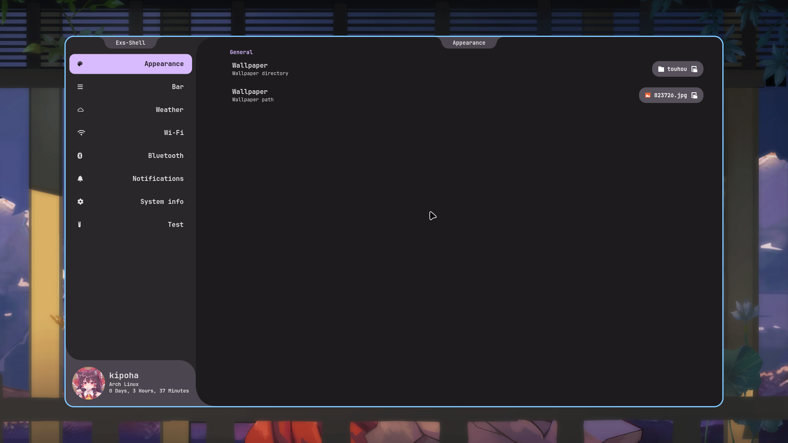
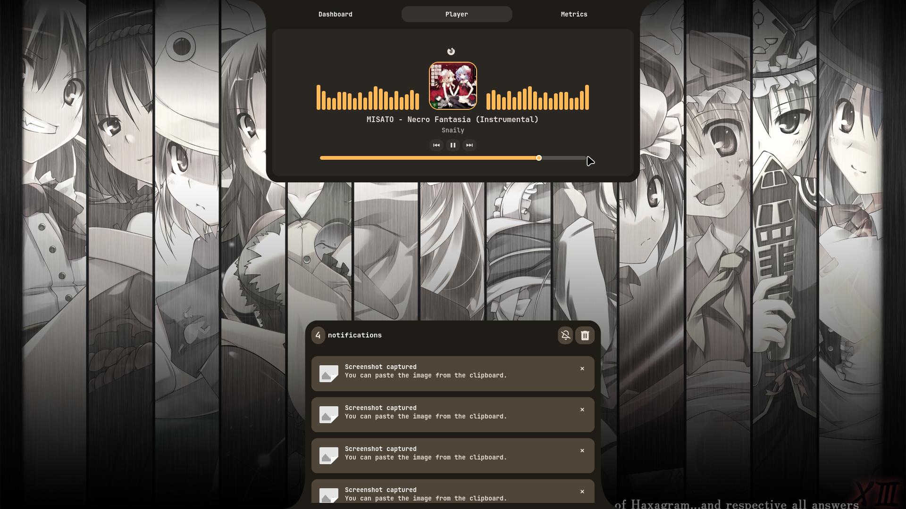
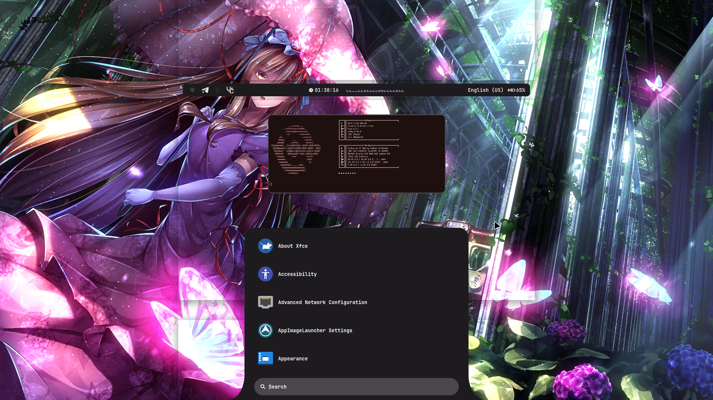

# exs-shell

A modern GTK4-based shell for the Niri Wayland compositor.
Highly customizable, lightweight and integrated with dynamic theming.

## Showcase
<div align="center">
    
    
    
    
    
    
    
</div>
<br /><br />


> [!WARNING]
> This shell currently works **only with the Niri Wayland compositor**.  
> The project is still under active development.
---

## Dependencies

Make sure the following packages are installed:

- jetbrains-mono-nerd-font
- ttf-material-symbols
- dart-sass
- dunst
- matugen
- gtk3
- power-profiles-daemon

---
## Installation

### Quick install (recommended)
```bash
curl -fsSl https://raw.githubusercontent.com/kipoha/exs-shell/refs/heads/main/scripts/install.sh | sudo bash
```
### Manual install
```bash
git clone https://github.com/kipoha/exs-shell.git
cd exs-shell
chmod +x scripts/install-local.sh
sudo ./scripts/install.sh
```

### Development install
```bash
git clone https://github.com/kipoha/exs-shell.git
cd exs-shell
chmod +x scripts/install-dev.sh
sudo ./scripts/install-dev.sh
```
---

### Verify installation:
```bash
which exs
```

### IPC commands (optional)

Example:

```bash
exs ipc launcher toggle
```

### Use to see all commands
```
exs -h
```


## Uninstall
```bash
curl -fsSl https://raw.githubusercontent.com/kipoha/exs-shell/refs/heads/main/scripts/unstall.sh | sudo bash
```


[Discord](https://discord.com/invite/FbdqgpnY9P)
